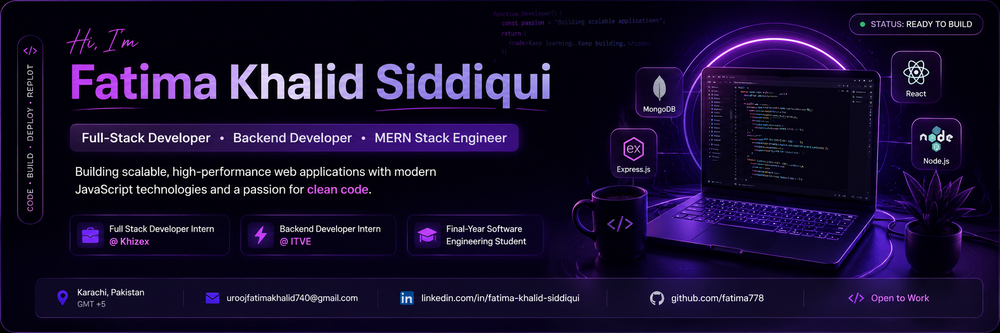

<p align="center">
  
</p>

<h1 align="center">Hi!, I'm Fatima Khalid Siddiqui</h1>

<h3 align="center">
Full-Stack Developer • Backend Developer • MERN Stack Engineer
</h3>

<p align="center">
Building scalable web applications with modern JavaScript technologies.
</p>

<p align="center">

</p>

<p align="center">

</p>

---

# 💜 Developer Dashboard

```yaml
Name: Fatima Khalid Siddiqui

Role: Full-Stack Developer

Education:
  BS Software Engineering
  Sindh Madressatul Islam University

Current Status:
  - Building production-ready applications

Current Internships:
  • Full Stack Developer @ Khizex
  • Backend Developer @ ITVE

Tech Focus:
  • React.js
  • Node.js
  • Express.js
  • MongoDB

Currently Learning:
  • Laravel
  • System Design
  • Clean Architecture

Looking For:
  Full-Time Software Engineer Opportunities
```

## 💜 About Me

```javascript
const fatima = {
  name: "Fatima Khalid Siddiqui",
  role: "Full-Stack Developer",
  education: "BS Software Engineering @ SMIU",
  location: "Karachi, Pakistan",

  currentlyWorking: [
    "Full Stack Developer Intern @ Khizex",
    "Backend Developer Intern @ ITVE"
  ],

  specialization: [
    "React.js",
    "Node.js",
    "Express.js",
    "MongoDB",
    "REST APIs"
  ],

  currentlyLearning: [
    "Laravel",
    "System Design",
    "Clean Architecture"
  ],

  askMeAbout: [
    "MERN Stack",
    "Backend Development",
    "API Development"
  ],

  funFact: "I enjoy building products that solve real-world problems 🚀"
};
```

## Tech Arsenal

<p align="center">


</p>

##  Current Focus

-  Building production-ready full-stack applications
-  Learning Laravel and software architecture
-  Contributing to real-world internship projects
-  Preparing for Software Engineer roles
